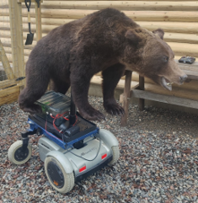
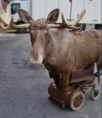
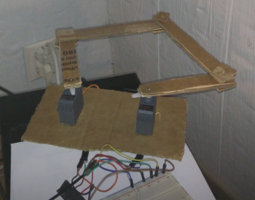
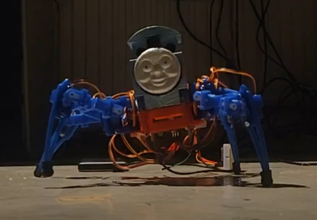
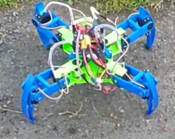
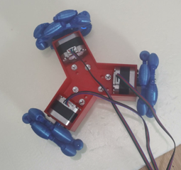
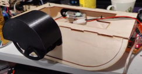
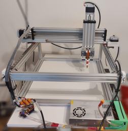
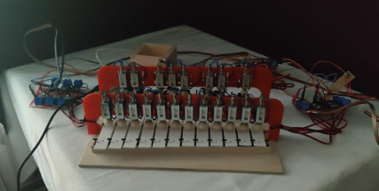
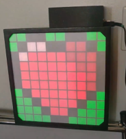

# Portfolio
Juho Kalliokoski

## Robots:
### Remote controlled bear

Modified electric wheelchair for training hunting dogs. The wheelchair is controlled using a remote controller. The remote controllers signal is processed by Arduino Nano, which then controls servo motors that move the joystick of the wheelchair. In addition to the movement the user can trigger sound effects (bear growling) using the remote controller.

### Remote controlled moose

Similarly to the bear robot the moose robot consists of wheelchair with a life-sized moose picture, and it is used for training dogs. The moose is controlled in similar fashion to the bear robot with a difference that it doesn't have sound effects, but it has a "kick"-mechanic to scare off dogs that get too close.

### Scara robot

This robot is one of the first I have made. It consists of two servo-motors, that control 4 linked rods. The robot receives coordinates where the end link is wanted, and it calculates the servo angles using simple inverse-kinematics.

### Thomas spider robot

Four legged spider robot with 3 servos in each of the legs. More information can be seen in the Android folder: [Android](Android).

### Bigger spider robot

This robot is based on the Thomas the tank engine robot, but it has been re-designed from the ground up by myself. It is bigger (30cm accross) and has stronger servo motors. It can also be controlled remotely with android phone using bluetooth.

### Omniwheel robot

This was my first tryout to create a omniwheeled robot. The wheels and the frame are completely 3D-printed, and the motors used are Nema17 stepper motors using basic stepper motor controllers. The robot movement was a bit wobbly as it didn't have enough friction due to the 3D-printed wheels.

### Boat

This paddle boat was made using laser cutted plywood and acryl, and some 3D-printed parts. The frame was laser cut and the paddles and motor mounts were 3D-printed. It can be controlled using a remote controller, and it moves like a differential-drive robot controlling the speeds of the paddles on the each side of the boat.

### "Milling" machine

This was my try-out into building my own milling machine using aluminum-extrusions and Nema23 stepper motors. In the end the frame and motors were not precise enough for their intended purpose (milling pcbs), but it worked great as a pen plotter.

### Automatic Glockenspiel

This is an automatic glockenspiel that can play midi-songs sent to it using usb cable. It consists of a normal glockenspiel, 3D-printed frame and 20 MOSFET driven solenoids with woodel balls attached to them. Whole thing is controlled by Raspberry Pi Pico.

### Led-Screen

This was my side project testing my new SK6812 digitally adressable LEDs. It is powered by ESP32 board and it can receive multiple pictures that it will then display as an animation until new pictures are sent to it. More information can be seen in the Android folder: [Arduino](Arduino).
